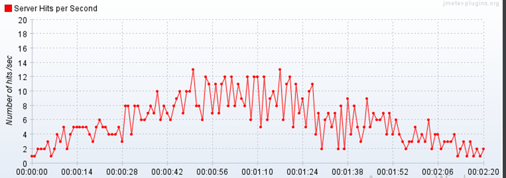
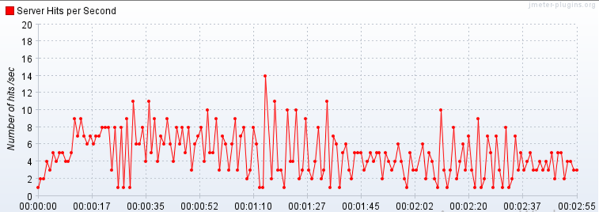
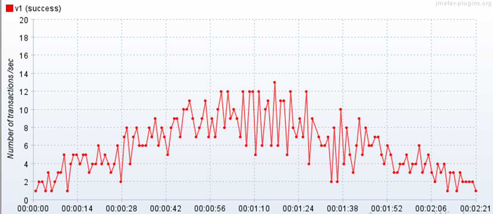
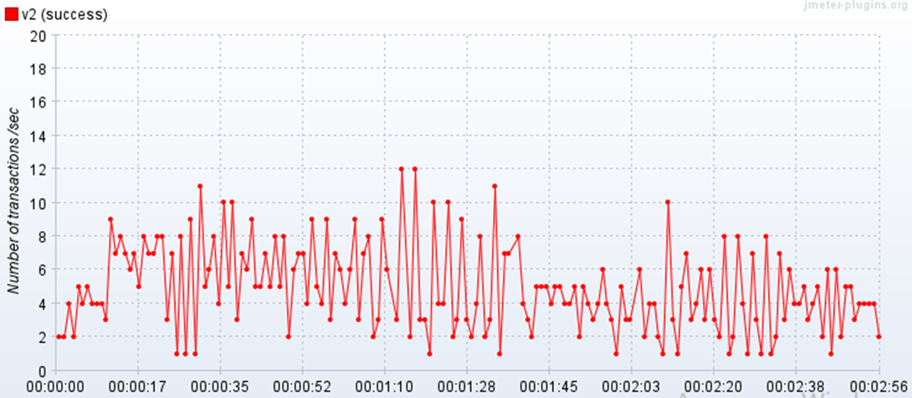
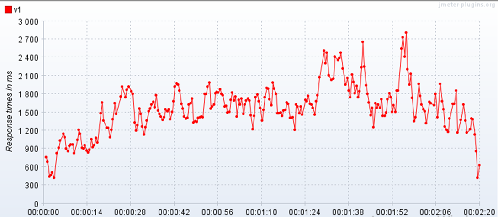
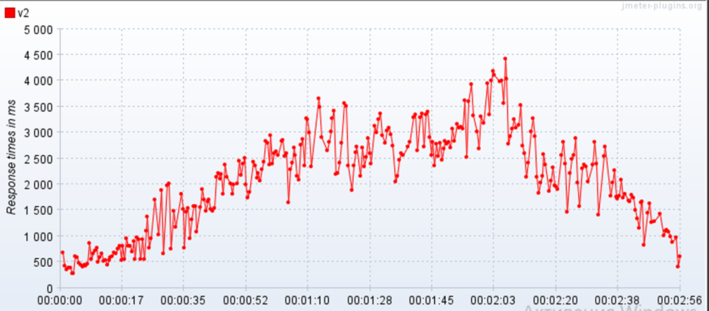

1. Процедура 2 занимает больше времени в сравнение с процедурой 1 - разница около 30 секунд.

2. На графиках "Число запросов" и "Число транзакций" процедура 1 демонстрирует более явно выраженный восходящий тренд до пиковых значений и далее их постепенное снижение. Показатели процедуры 2 более ломаные.

3. Время отклика по первой процедуре на большей части графика в пределах 2 секунд, есть пиковые значения до 2,4 - 2,8 секунд. В процедуре 2 больше половины времени отклик составляет от 2 до 4,5 секунд.

**Число запросов**
Процедура 1

Процедура 2

**Число транзакций** Процедура 1

Процедура 2

**Время отклика** Процедура 1

Процедура 2

   
