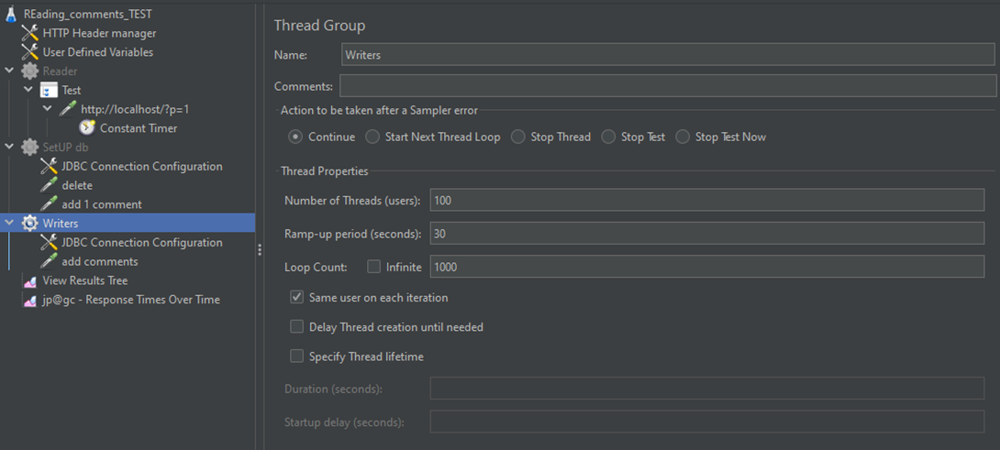
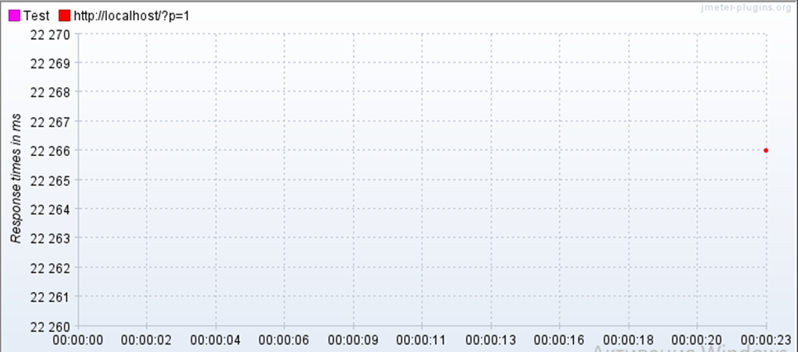
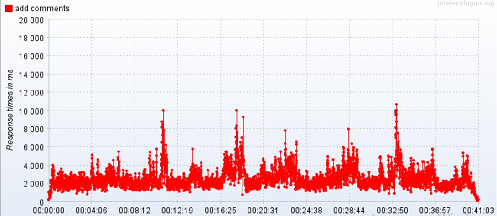
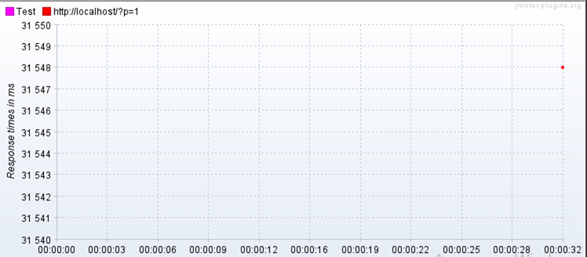

1. Настройки для тестов веб-приложения и базы данных:

- чтение комментариев к посту после обновления страницы
- добавление одного комментария в базу данных
- добавление 200 000 комментариев в базу данных

2. Время отклика при прочтении даже одного комментария на моей машине составляет более 20 секунд

3. Время загрузки 200 000 комментариев составило 41 минуту

4. Время отклика при прочтении 200 000 комментариев составило более 30 секунд

